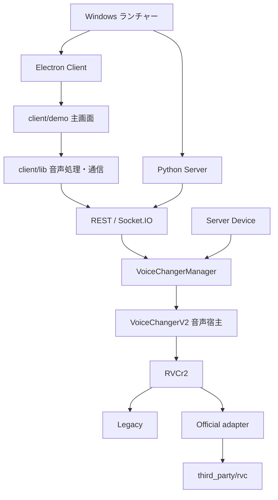

# 現在の構成と開発方針

## 製品の構成

VCClient は、画面・音声デバイス・モデル管理と、推論バックエンドを組み合わせたリアルタイム音声変換アプリケーションです。

この図は現在の RVC 経路です。Manager は他のモデルも扱い、モデルにより旧 `VoiceChanger` または `VoiceChangerV2` を使用します。

| 区分 | 意味 |
| --- | --- |
| Client Device / Server Device | 音声の収録・再生をブラウザ側とサーバ側のどちらで行うか |
| Legacy / Official | RVC の推論実装の選択。既定は Legacy |
| VoiceChanger / VoiceChangerV2 | モデルを呼び出す音声宿主の世代。Legacy / Official とは別の区分 |

RVC の入力は音声宿主からバックエンドに渡し、結果を宿主で SOLA・クロスフェードして出力します。バックエンド側で同じ接続処理を重ねません。ブラウザ内推論を使用する Web edition は別経路で、現在の Windows / RVC 主線の検証範囲には含めません。

## 保守の範囲

- Windows / NVIDIA GPU と RVC を優先します。デスクトップ起動、導入、更新時のデータ保持、配布の再現性を整えます。
- Legacy は既存経路として維持します。Official は固定上流の処理をできるだけ保ち、必要な入出力・リソース・ライフサイクルの調整に限定します。
- Recorder は保守対象外です。学習・旧 Docker・他モデルの資材は現存しますが、Windows / RVC と同じ検証状況とはみなしません。
- 操作説明と機能の実装状態を分け、未実装・未検証の内容を対応済みとして表示しません。

## 今後の独自バックエンド

Hybrid は現在、将来の実装場所を示す予約です。選択可能なバックエンドではありません。

独自バックエンドでは音質・遅延・安定性を検証しながら、必要な音声処理と実行環境を開発する方針です。Intel NPU はこの新バックエンドのみで検討し、Legacy / Official には追加しません。狙いは独立 GPU の負荷軽減と消費電力の削減です。ハードウェア対応・性能は未検証です。

新バックエンドの独立リポジトリ化は検討中です。分離する場合は、モデル・リソースの明示的なパスと音声データを受け取るエンジンとし、VCClient の UI・モデルスロット・ダウンローダーには依存させません。現在の共有 RVC ディレクトリをそのまま移動する計画ではありません。

## 詳細

- [Official 統合仕様](rvc-upstream-integration.md)
- [固定上流の更新手順](rvc-upstream-update.md)
- [過去の構成図](archive/diagrams/voice-changer-architecture.html)（作成時点の参考資料）
