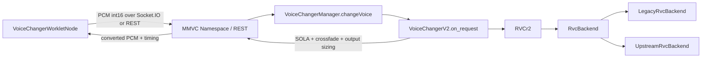
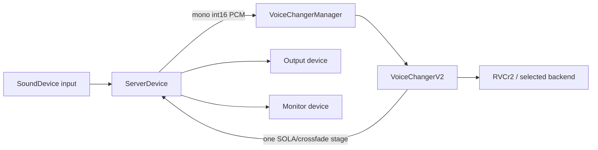

# VCClient × Official RVC upstream integration

## Scope and pinned upstream

VCClient remains the application host. Official RVC is an inference backend;
it never opens audio devices, handles LAN transport, owns model slots, or
chooses a GPU. The vendored runtime is pinned to
`81eed5e8f68b6bed1789f682fe78cdd324495afc` (2026-08-04). Metadata and local
patch rationale live in `third_party/rvc/UPSTREAM.md`.

The first-stage runtime selector is `rvcBackend=legacy|official`, defaults to
`legacy`, is persisted as an application setting, and is deliberately not part
of `RVCModelSlot`.

## Current VCClient call paths

### Browser/LAN client



`VoiceChangerWorkletNode` owns browser capture/playback and chunk scheduling.
Socket.IO `MMVC_Namespace.on_request_message` and the REST endpoint unpack PCM
and call the same `VoiceChangerManager.changeVoice` entry point. The server is
therefore the only process that needs the Official runtime, model, index, and
CUDA dependencies in LAN mode.

### Server Device



`ServerDevice` keeps input/output/monitor ids, gain, sample rate, buffering,
and exclusive-mode behavior. Backends receive only audio arrays and stream
geometry; they never receive device ids.

## Backend boundary

`server/voice_changer/RVC/backend/base.py` defines the narrow contract:

- load/unload/close model resources;
- infer one VCClient chunk with explicit sample rates and overlap geometry;
- update runtime settings;
- rebuild on an explicit GPU change;
- expose backend/model diagnostics.

`RVCr2` owns the existing `RVCSettings`, selects a backend, and delegates. It
does not import HuBERT, RMVPE, FAISS, synthesizers, or CUDA Graph code.

`LegacyRvcBackend` contains the previous `RVCr2` buffer, resample, Pipeline,
Embedder, PitchExtractor, Inferencer, index, and precision-fallback behavior.
The legacy directories remain unchanged and are still shared by other VCClient
models such as EasyVC and DiffusionSVC.

`UpstreamRvcBackend` loads `infer/rtrvc.py` from a private package namespace.
It supplies a small config object containing only the selected `torch.device`,
precision, and CUDA Graph result; it does not instantiate upstream's global
`Config` singleton.

## Setting mapping

| VCClient setting | Official realtime mapping |
| --- | --- |
| `tran` | `RVC.change_key` / `f0_up_key` |
| `indexRatio` | `RVC.change_index_rate` / `index_rate` |
| `protect` | unsupported by the pinned Official realtime entry point; rejected and hidden while Official is active |
| `gpu=N` | exact `torch.device("cuda:N")`; invalid ids fail visibly |
| `gpu<0` | `torch.device("cpu")` |
| `dstId` | realtime synthesizer speaker tensor |
| `f0Detector` | `rmvpe`, `fcpe`, or `pm` only |
| formant | fixed to `0` in stage one |

When switching to Official from a legacy-only detector (for example
`rmvpe_onnx`), the host selects `rmvpe` and reports that decision in the log.
The UI filters the Official list instead of pretending other detectors work.

## Streaming and sample-rate ownership

```text
Device/client PCM (input SR, int16)
  -> backend input normalization
  -> one input resample to 16 kHz
  -> Official feature/F0/index/synth context
  -> model sample-rate audio
  -> backend output resample to VCClient output SR when required
  -> VoiceChangerV2 SOLA/crossfade and output-size normalization
  -> device/client output
```

Official の音声時刻は、入力の累積サンプル数 `N` と、出力の累積サンプル数
`floor(N * outputSR / inputSR)` で管理します。コールバックごとの長さを丸めて
足し合わせません。入力はグローバルな 10 ms 境界にそろえたフィルター履歴と
10 ms の先読みを使って 16 kHz にリサンプルし、完全な 160 サンプル単位で
上流へ渡します。`block_frame_16k` は今回進める入力と pitch cache の量です。
`skip_head` は extra context、`return_length` は今回の出力と本物の重複区間を
含むモデル窓の長さで、どちらも 10 ms フレーム単位です。モデル・特徴抽出・
検索アルゴリズムは固定上流のままです。

入力単位の設定 overlap/search は、それぞれ `floor(samples * outputSR / inputSR)`
で出力単位に変換します。出力 overlap を `C`、search を `S` とすると、固定遅延は
`D = C + S + outputSR / 50` サンプルです。最後の 20 ms は、リサンプルの先読み
10 ms と、未完成 pitch フレームを待つための 10 ms です。旧実装の 10 ms キューに
旧 PCM を付け足す方式は廃止しました。入力のフィルター先読みをなくせば遅延を
減らせますが、任意のコールバック境界をまたぐ波形の一致は保証できません。

今回の出力位置を `P`、今回の出力サンプル数を `B` とすると、バックエンドは
`[P - D, P + B + C + S - D)` を**今回の推論で生成**します。過去に出力した PCM
を先頭にコピーすることはありません。モデル出力が短い・非有限の場合は失敗とし、
補完で成功扱いにしません。負の入力時刻だけが明示的な開始時の無音です。
VoiceChangerV2 はこの窓に一度だけ SOLA を適用し、`B` サンプルを返します。
最初の応答も要求に対応する長さで、固定 4096 サンプルの捨てブロックはありません。
SOLA の検索オフセット `o` により、混合区間後の実際の位置は `P - D + o`、
`0 <= o <= S` です。これは累積ドリフトとは区別します。

設定 overlap はコールバックの長さによらず推論窓に確保します。短いコールバック
では実際の混合長を `min(C, B)` とし、宿主が前回予測の未使用の重複区間を保持します。
4097/4001 のように長さが変わっても時刻の原点を変更しません。設定 overlap/search、
サンプルレート、`extraConvertSize` が変わるとストリームを再構築し、開始遅延が再発生します。
入力・出力レートは 16000/24000/32000/40000/44100/48000/88200/96000 Hz、
モデルレートは 32000/40000/48000 Hz を受け付けます。入力は mono、1 ブロックは
10 ms 以上です。上流 pitch cache の 1024 フレームを超える窓は明示的に拒否します。
これらの受け付け範囲すべてを実モデルで検証したという意味ではありません。
CPU 上のリサンプル最適化は別途計測して判断します。

### ストリーム再構築と設定の受け付け

`RVCr2.update_settings()` の bool は設定を受け付けたかを表します。
`get_stream_generation()` はそれとは独立した `(hostGeneration, backendGeneration)`
で、モデル再初期化、成功した置換、失敗後の復旧、復旧失敗による停止、
レート・コンテキストの変更を宿主へ通知します。VoiceChangerV2 は設定更新時と
推論直後にこの値を確認し、古い SOLA 履歴を破棄します。失敗した候補設定は
引き続き `False`、選択値は以前のまま、原因は `backendError` に残ります。
復旧も失敗した場合は `ready=false` です。通常の設定拒否と同値更新では、
実際の再構築がなければ音声履歴を消去しません。

Legacy の既存音声アルゴリズムと既定選択は維持します。Legacy の zero-crossfade
に関する既知の問題は今回の Official 修正の対象外です。

## Resource and dependency compatibility

Current Official RVC uses a local Transformers-format HuBERT directory, not
VCClient's historical fairseq `hubert_base.pt`. Supply it with
`--rvc_upstream_hubert`; the default is
`pretrain/rvc-upstream-hubert-base` and must contain `config.json`,
`preprocessor_config.json`, and `pytorch_model.bin`. The existing
`--rmvpe pretrain/rmvpe.pt` resource is reused. VCClient's existing weight
downloader obtains those three files from the model repository linked by the
Official RVC README, pinned to revision
`e6d0c1a17da07c33557852f9dfa2bd44cc75737d`; `--rvc_upstream_hubert` remains
available for offline or custom release layouts.

Official-only HuBERT files are no longer part of the unconditional server
startup download. When Official is selected, the default pinned files are
downloaded on demand with connection/read timeouts, HTTP status checks,
SHA-256 verification, and atomic replacement. `--skip-downloads` disables this
behavior, and a complete custom `--rvc_upstream_hubert` directory is accepted
without replacing its contents. A missing or invalid Official resource leaves
the previously ready backend selected and reports `backendError`.

Windows NVIDIA の現行環境は [Windows セットアップ](windows-setup.md) と
`server/requirements/windows-cuda.lock` を参照してください。Official の WebUI
全体ではなく vendored runtime slice だけをホスト環境で動かすため、上流の
requirements の範囲外でも、実際に使用する import、モデルロード、推論経路を
検証したバージョンを固定しています。

| Dependency | Official upstream | Windows NVIDIA resolution | Reason / boundary |
| --- | --- | --- | --- |
| Python | 3.12 x64 | 3.12.14 | Matches the upstream runtime generation and the available Windows fairseq wheel. |
| torch / torchaudio | 2.7.1 + CUDA 11.8 or 12.8 | 2.11.0 + CUDA 13.0 | Host-wide pair; Torch CUDA execution and both real RVC backends were exercised together. |
| numpy / scipy | NumPy 1.26.x, SciPy 1.x | 2.5.2 / 1.18.1 | Host-wide numerical stack; the imported runtime path passed model inference, while excluded WebUI paths are not claimed compatible. |
| faiss-cpu | 1.13.x | 1.15.0 | Same public index API used by realtime retrieval. |
| transformers | 4.49.x | 5.16.1 | The local `HubertModel.from_pretrained` path was exercised with the pinned assets; unrelated WebUI APIs are excluded. |
| onnxruntime-gpu | 1.18/1.19 by CUDA profile | 1.29.0 | Host and Legacy ONNX support only; the Official first-stage backend is PyTorch-only. |
| librosa | 0.10.x | 1.0.0 | Host/other-model audio utility; not part of the selected Official realtime call path. |
| FastAPI / Uvicorn / Socket.IO | WebUI-specific old ranges | 0.141.1 / 0.52.4 / 5.16.4 | VCClient owns HTTP, Socket.IO, and static hosting; upstream WebUI and Gradio are not imported. |
| sounddevice | 0.5.x | 0.5.6 | VCClient Server Device only; Official receives PCM arrays, never device ids. |
| praat-parselmouth / torchfcpe | 0.4.5+ / 0.0.4+ | 0.4.7 / 0.0.4 | Used for the Official `pm` and `fcpe` options. |

The upstream WebUI requirements are intentionally not installed wholesale.
Gradio, upstream FastAPI pins, sounddevice, and application packages are not
part of the inference adapter.

## M1 upstream delta decisions

The pinned source and the vendored runtime were compared file by file against
upstream commit `81eed5e8f68b6bed1789f682fe78cdd324495afc`. These decisions are the
input to lifecycle work in M2 and convergence work in M3; they do not claim
that all current differences are already correct.

| Current delta | Decision | Owner / follow-up |
| --- | --- | --- |
| Package-relative imports and package `__init__.py` files | Keep as required embedding adaptation | Vendor boundary; avoids `sys.path`, `os.chdir`, and generic `infer`/`tools` collisions. |
| Explicit HuBERT and RMVPE resource paths | Keep as required embedding adaptation | Adapter supplies host-owned paths; no process working-directory dependency. |
| Constructor failures re-raised | Keep as required error adaptation | Adapter translates initialization failures into typed backend errors. Retrieval behavior remains identical to upstream. |
| Realtime speaker id instead of upstream's fixed speaker zero | Keep as required model-slot adaptation | VCClient already exposes `dstId`; validate the checkpoint range before inference. |
| Per-device CUDA Graph enablement, teardown, and replay fallback | Keep provisionally as host lifecycle adaptation | M2 must verify device switching and resource release; M4 must cover replayable tests. |
| Realtime `protect` feature blending added to `infer/rtrvc.py` | Removed in M3 | Official rejects the setting and the UI hides the Legacy-only control. |
| Forced FAISS IVF `nprobe` and retrieval-error policy changes | Removed in M3 | The vendored search block now matches the pinned upstream behavior. |
| Adapter silence short-circuit and `sqrt(volume)` output shaping | Removed in M3 | Official always advances upstream inference and keeps only PCM unit conversion. |
| Adapter-owned window and resampling geometry | Minimized and verified in M3 | A frame accumulator and output queue bridge arbitrary host chunks to upstream's fixed 10 ms contract. |

The runtime resource contract is intentionally small:

- vendored `infer/`, `configs/`, `i18n/`, `tools/`, upstream license, and pin metadata;
- a Transformers HuBERT directory containing `config.json`,
  `preprocessor_config.json`, and `pytorch_model.bin`;
- `rmvpe.pt` when RMVPE is selected, and installed FCPE/Parselmouth packages
  for their corresponding detectors;
- the selected `.pth` checkpoint and optional `.index` from the VCClient model
  slot;
- one explicit CPU or `cuda:N` device selected by VCClient.

Missing Official-only resources must make Official unavailable without
preventing Legacy startup. Resource preparation is therefore on demand; M2
owns the remaining lifecycle correction.

## Errors and fallback

Backend exceptions distinguish configuration, model, index, device, inference,
and CUDA Graph failures. Full tracebacks remain in server logs; `backendError`
in server info carries the human-readable initialization error. Selecting
Official never silently falls back to Legacy. Backend and GPU changes are
transactional: the previous model is released under the lifecycle lock to avoid
double VRAM allocation, and a candidate must load and warm before the new
setting becomes visible. On failure the previous backend is rebuilt, the
requested setting is not persisted, and `backendError` describes the failed
request. Model inference, backend/device replacement, sampling-rate changes, and outer
SOLA/crossfade state reset share lifecycle locks so an in-flight block cannot
observe partially released resources.

## Validation boundaries and current limitations

Unit tests cover the boundary, selector, config mapping, device selection, and
checkpoint metadata without requiring a GPU or large model fixture. The MIA v2
model has also passed direct Official-backend smoke tests on an RTX 5090 D v2:
RMVPE, FAISS retrieval, eager inference, and CUDA Graph capture/replay all
produced non-silent 48 kHz output. This external model and its large assets are
not part of the repository, so source-only CI still cannot repeat that test.
Audio-quality listening remains a manual acceptance gate; the repeatable M4
engineering checks below do not make a subjective quality claim.

Shape-specific CUDA Graph capture occurs on the first matching live block.
Shared HuBERT/RMVPE reuse across different `RVCr2` instances is not yet enabled;
device correctness is prioritized over cross-model load speed in stage one.

## Runtime diagnostics and A/B measurement

Run the dependency, native-library, CUDA-device, vendor, and asset checks before
starting a real model test:

```powershell
python server/tools/check_rvc_runtime.py --gpu 0 --strict
```

The probe imports native packages in isolated child processes using VCClient's
NumPy-then-Torch application order, and separately reports whether a direct
Torch import is fragile. It reports an OpenMP/DLL crash or import timeout
without applying unsafe environment-variable workarounds to the server process.

For a direct Official-backend smoke test before starting the server, use the
read-only model/index paths with `server/tools/smoke_rvc_official.py`. The tool
writes output only when `--output` is supplied and reports load/warmup time,
per-block latency, CUDA memory, and per-owner CUDA Graph capture statistics.

With VCClient running and an RVC slot selected, benchmark both backends through
the same public REST path used by clients:

```powershell
python server/tools/benchmark_rvc_backends.py `
  --url http://127.0.0.1:18888 `
  --wav server/test.wav `
  --backends legacy official `
  --warmup 20 --requests 200 `
  --output-dir test_output `
  --json test_output/report.json
```

The tool restores the previously selected backend. It records REST round-trip
Mean/P50/P95, backend-local Mean/P50/P95, output length, VCClient performance,
selected device, and process-level CUDA allocated/reserved/peak memory. CUDA
memory values are process-wide readings for the selected device, not exclusive
ownership accounting for one backend. Backend metrics are reset after the
requested warmup calls, so their percentiles cover the same measured request
window as the REST statistics. The WAV sample rate must match VCClient's current
input sample rate.

## M4 Windows end-to-end acceptance (2026-09-07)

The normal model-slot path loaded the same external MIA v2 checkpoint and index
for both backends on GPU 0. A public `/test` comparison used ten warmups plus
100 measured 4097-sample requests per backend. Both returned exactly 409,700
samples. Legacy REST mean/P50/P95 was 99.322/99.257/131.339 ms and backend-local
mean/P50/P95 was 94.833/94.975/125.454 ms. Official REST was
19.093/18.367/22.363 ms and backend-local was 14.624/14.027/17.624 ms. These are
same-host request timings, not acoustic end-to-end latency.

The server-device loop then ran for 600.063 seconds at 44.1 kHz using the
physical Razer Seiren V3 Mini input and Shanling UA2 output. It completed 6,317
callback inferences with zero reported errors. A 32→40 read-chunk switch at
300.360 seconds stayed healthy; final backend P95 was 23.771 ms. CUDA allocated
memory stayed at 1,138.650 MiB for the first shape, stepped to 1,183.308 MiB on
the first new-shape capture, and remained flat through the end. A cold follow-up
observed the first callback within 922 ms, including device open and graph
capture. Output gain was deliberately zero during the unattended run, so this
proves the physical input/output stream and callback chain but not listening
quality.

A separate paced test addressed the server through its non-loopback
`192.168.50.11` LAN interface for 600.094 seconds. It completed 2,738 requests
while rotating 12,000, 4,097, and 16,000-sample shapes 23 times. First response
was 359 ms; mean/P50/P95/max request time was 27.747/31.000/47.000/500.000 ms,
with zero request errors and zero output-length mismatches. CUDA allocated
memory reached 1,284.041 MiB while the three graph shapes were captured in the
first 120 seconds, then remained unchanged for the remaining eight minutes.
The client used the same computer's LAN NIC, which exercises the bound LAN
address and HTTP path but is not represented as a second-host network test.

The vendor replay command rebuilt 42 runtime files from upstream commit
`81eed5e8f68b6bed1789f682fe78cdd324495afc`, verified source SHA-256 values,
applied `0001-vcclient-runtime-adapter.patch`, and matched the checked-in tree.
The source checkout had unrelated local changes; use of `git show` kept those
changes outside the import.

Finally, the Windows CUDA package was rebuilt after removing runtime-irrelevant
ONNX/setuptools test fixtures and Torch C++ headers/CMake files that caused a
real WinError 206 extraction failure. The corrected archive is 2,529,037,600
bytes with SHA-256
`9488703896c2c0fb1928673d53a6cd308ae513877028a210cdceb74e923d74ec`.
All 23,017 manifest entries were rehashed after extraction to a long path
containing spaces. The package includes the vendor manifest, applicable patch,
upstream license, and soak tool; it excludes user models, settings, keys, and
pretrain weights as designed. With `PYTHONHOME`/`PYTHONPATH` removed and PATH
limited to the package plus Windows System32, the relocated runtime passed
Legacy/Official imports, CUDA/ONNX execution, and an actual `/info` server
startup on port 18891. This isolates the portable package from system Python;
it is not a claim of testing on a second physical Windows installation.
## 実行時メトリクスと長時間検証

`inferenceCount` は推論の試行回数であり、成功を意味しない。`inferenceSuccessCount` と `inferenceFailureCount` の合計が試行回数になり、入力サンプルは `inferenceInputSamples`、Official が生成したコンテキストを含む出力は `inferenceOutputSamples` に記録される。実際にホストから返したサンプルは `hostRuntimeInfo.outputSamples`、失敗時の短いフォールバックは `fallbackSamples` として分離する。

`serverDeviceRuntimeInfo` は PortAudio のストリーム状態、入力コールバック、推論済みブロック、出力書き込み、コールバック例外、underflow/overflow/unknown status、キュー破棄、メインループ例外を別々に報告する。`active` は開始要求 (`serverAudioStated`) と独立した実ストリーム状態である。未取得の項目は 0 で埋めず unknown として扱う。

`server/tools/soak_rvc_runtime.py` は成功推論とホスト出力の継続進行、epoch/generation の不変性、失敗・例外・状態イベント、HTTP 応答と出力長の整合を検査する。報告の `errors` は人間向けメッセージ、`errorTypes` は `runtime`、`stalled`、`counter_reset`、`device_callback`、`http`、`output_length`、`unknown_metric` などの診断分類である。過去の `errors=[]` の記録は旧ツールの観測範囲を示すだけで、推論成功や音声コールバックの無故障を証明しない。
