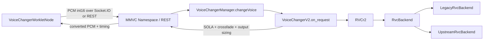
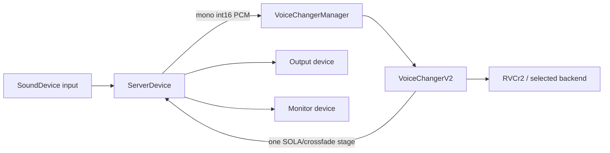

# VCClient × Official RVC upstream integration

## Scope and pinned upstream

VCClient remains the application host. Official RVC is an inference backend;
it never opens audio devices, handles LAN transport, owns model slots, or
chooses a GPU. The vendored runtime is pinned to
`81eed5e8f68b6bed1789f682fe78cdd324495afc` (2026-08-04). Metadata and local
patch rationale live in `third_party/rvc/UPSTREAM.md`.

The first-stage runtime selector is `rvcBackend=legacy|official`, defaults to
`legacy`, is persisted as an application setting, and is deliberately not part
of `RVCModelSlot`.

## Current VCClient call paths

### Browser/LAN client



`VoiceChangerWorkletNode` owns browser capture/playback and chunk scheduling.
Socket.IO `MMVC_Namespace.on_request_message` and the REST endpoint unpack PCM
and call the same `VoiceChangerManager.changeVoice` entry point. The server is
therefore the only process that needs the Official runtime, model, index, and
CUDA dependencies in LAN mode.

### Server Device



`ServerDevice` keeps input/output/monitor ids, gain, sample rate, buffering,
and exclusive-mode behavior. Backends receive only audio arrays and stream
geometry; they never receive device ids.

## Backend boundary

`server/voice_changer/RVC/backend/base.py` defines the narrow contract:

- load/unload/close model resources;
- infer one VCClient chunk with explicit sample rates and overlap geometry;
- update runtime settings;
- rebuild on an explicit GPU change;
- expose backend/model diagnostics.

`RVCr2` owns the existing `RVCSettings`, selects a backend, and delegates. It
does not import HuBERT, RMVPE, FAISS, synthesizers, or CUDA Graph code.

`LegacyRvcBackend` contains the previous `RVCr2` buffer, resample, Pipeline,
Embedder, PitchExtractor, Inferencer, index, and precision-fallback behavior.
The legacy directories remain unchanged and are still shared by other VCClient
models such as EasyVC and DiffusionSVC.

`UpstreamRvcBackend` loads `infer/rtrvc.py` from a private package namespace.
It supplies a small config object containing only the selected `torch.device`,
precision, and CUDA Graph result; it does not instantiate upstream's global
`Config` singleton.

## Setting mapping

| VCClient setting | Official realtime mapping |
| --- | --- |
| `tran` | `RVC.change_key` / `f0_up_key` |
| `indexRatio` | `RVC.change_index_rate` / `index_rate` |
| `protect` | downstream-exposed official feature-protect blend |
| `gpu=N` | exact `torch.device("cuda:N")`; invalid ids fail visibly |
| `gpu<0` | `torch.device("cpu")` |
| `dstId` | realtime synthesizer speaker tensor |
| `f0Detector` | `rmvpe`, `fcpe`, or `pm` only |
| formant | fixed to `0` in stage one |

When switching to Official from a legacy-only detector (for example
`rmvpe_onnx`), the host selects `rmvpe` and reports that decision in the log.
The UI filters the Official list instead of pretending other detectors work.

## Streaming and sample-rate ownership

```text
Device/client PCM (input SR, int16)
  -> backend input normalization
  -> one input resample to 16 kHz
  -> Official feature/F0/index/synth context
  -> model sample-rate audio
  -> backend output resample to VCClient output SR when required
  -> VoiceChangerV2 SOLA/crossfade and output-size normalization
  -> device/client output
```

The Official adapter maintains only model context: the rolling 16 kHz input
window and upstream pitch caches. `block_frame_16k` is the current resampled
block, `skip_head` is VCClient's extra context in 10 ms frames, and
`return_length` covers the current block plus VCClient crossfade and SOLA search
regions. Official GUI denoise, device streams, output SOLA, and monitor logic
are not used, so there is only one final stitch/crossfade stage.

The first implementation resamples on CPU for correctness and moves one tensor
to the selected device. Copy/resample optimization is deferred until profiling
shows it is safe.

## Resource and dependency compatibility

Current Official RVC uses a local Transformers-format HuBERT directory, not
VCClient's historical fairseq `hubert_base.pt`. Supply it with
`--rvc_upstream_hubert`; the default is
`pretrain/rvc-upstream-hubert-base` and must contain `config.json`,
`preprocessor_config.json`, and `pytorch_model.bin`. The existing
`--rmvpe pretrain/rmvpe.pt` resource is reused. VCClient's existing weight
downloader obtains those three files from the model repository linked by the
Official RVC README, pinned to revision
`e6d0c1a17da07c33557852f9dfa2bd44cc75737d`; `--rvc_upstream_hubert` remains
available for offline or custom release layouts.

| Dependency | VCClient before | Official upstream | Stage-one resolution |
| --- | --- | --- | --- |
| Python | historical release runtime | 3.12 x64 | do not force runtime migration in this change |
| torch / torchaudio | 2.0.1 / 2.0.2 | 2.7.1 CUDA 11.8 or 12.8 | retain VCClient pins; verify newer matrix separately |
| numpy | 1.23.5 | 1.26.4–1.x | retain 1.23.5 pending full regression |
| faiss-cpu | 1.7.3 | 1.13.x | retain 1.7.3 API-compatible retrieval path |
| transformers | absent | 4.49.x | add 4.49.0 |
| praat-parselmouth | absent | 0.4.5+ | add 0.4.5 for `pm` |
| torchfcpe | 0.0.3 | 0.0.4+ | update to 0.0.4 |

The upstream WebUI requirements are intentionally not installed wholesale.
Gradio, upstream FastAPI pins, sounddevice, and application packages are not
part of the inference adapter.

## Errors and fallback

Backend exceptions distinguish configuration, model, index, device, inference,
and CUDA Graph failures. Full tracebacks remain in server logs; `backendError`
in server info carries the human-readable initialization error. Selecting
Official never silently falls back to Legacy. The user can explicitly select
Legacy again.

## Validation boundaries and current limitations

Unit tests cover the boundary, selector, config mapping, device selection, and
checkpoint metadata without requiring a GPU or large model fixture. The MIA v2
model has also passed direct Official-backend smoke tests on an RTX 5090 D v2:
RMVPE, FAISS retrieval, eager inference, and CUDA Graph capture/replay all
produced non-silent 48 kHz output. This external model and its large assets are
not part of the repository, so source-only CI still cannot repeat that test.
Audio-quality listening, Legacy/Official REST A/B, LAN mode, and ten-minute
stability remain manual acceptance gates.

Shape-specific CUDA Graph capture occurs on the first matching live block.
Shared HuBERT/RMVPE reuse across different `RVCr2` instances is not yet enabled;
device correctness is prioritized over cross-model load speed in stage one.

## Runtime diagnostics and A/B measurement

Run the dependency, native-library, CUDA-device, vendor, and asset checks before
starting a real model test:

```powershell
python server/tools/check_rvc_runtime.py --gpu 0 --strict
```

The probe imports native packages in isolated child processes using VCClient's
NumPy-then-Torch application order, and separately reports whether a direct
Torch import is fragile. It reports an OpenMP/DLL crash or import timeout
without applying unsafe environment-variable workarounds to the server process.

For a direct Official-backend smoke test before starting the server, use the
read-only model/index paths with `server/tools/smoke_rvc_official.py`. The tool
writes output only when `--output` is supplied and reports load/warmup time,
per-block latency, CUDA memory, and per-owner CUDA Graph capture statistics.

With VCClient running and an RVC slot selected, benchmark both backends through
the same public REST path used by clients:

```powershell
python server/tools/benchmark_rvc_backends.py `
  --url http://127.0.0.1:18888 `
  --wav server/test.wav `
  --backends legacy official `
  --warmup 20 --requests 200 `
  --output-dir test_output `
  --json test_output/report.json
```

The tool restores the previously selected backend. It records REST round-trip
Mean/P50/P95, backend-local Mean/P50/P95, output length, VCClient performance,
selected device, and process-level CUDA allocated/reserved/peak memory. CUDA
memory values are process-wide readings for the selected device, not exclusive
ownership accounting for one backend. Backend metrics are reset after the
requested warmup calls, so their percentiles cover the same measured request
window as the REST statistics. The WAV sample rate must match VCClient's current
input sample rate.
