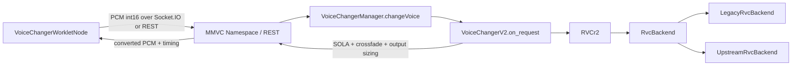
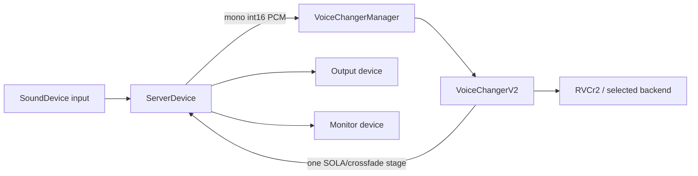

# VCClient × Official RVC upstream integration

## Scope and pinned upstream

VCClient remains the application host. Official RVC is an inference backend;
it never opens audio devices, handles LAN transport, owns model slots, or
chooses a GPU. The vendored runtime is pinned to
`81eed5e8f68b6bed1789f682fe78cdd324495afc` (2026-08-04). Metadata and local
patch rationale live in `third_party/rvc/UPSTREAM.md`.

The first-stage runtime selector is `rvcBackend=legacy|official`, defaults to
`legacy`, is persisted as an application setting, and is deliberately not part
of `RVCModelSlot`.

## Current VCClient call paths

### Browser/LAN client



`VoiceChangerWorkletNode` owns browser capture/playback and chunk scheduling.
Socket.IO `MMVC_Namespace.on_request_message` and the REST endpoint unpack PCM
and call the same `VoiceChangerManager.changeVoice` entry point. The server is
therefore the only process that needs the Official runtime, model, index, and
CUDA dependencies in LAN mode.

### Server Device



`ServerDevice` keeps input/output/monitor ids, gain, sample rate, buffering,
and exclusive-mode behavior. Backends receive only audio arrays and stream
geometry; they never receive device ids.

## Backend boundary

`server/voice_changer/RVC/backend/base.py` defines the narrow contract:

- load/unload/close model resources;
- infer one VCClient chunk with explicit sample rates and overlap geometry;
- update runtime settings;
- rebuild on an explicit GPU change;
- expose backend/model diagnostics.

`RVCr2` owns the existing `RVCSettings`, selects a backend, and delegates. It
does not import HuBERT, RMVPE, FAISS, synthesizers, or CUDA Graph code.

`LegacyRvcBackend` contains the previous `RVCr2` buffer, resample, Pipeline,
Embedder, PitchExtractor, Inferencer, index, and precision-fallback behavior.
The legacy directories remain unchanged and are still shared by other VCClient
models such as EasyVC and DiffusionSVC.

`UpstreamRvcBackend` loads `infer/rtrvc.py` from a private package namespace.
It supplies a small config object containing only the selected `torch.device`,
precision, and CUDA Graph result; it does not instantiate upstream's global
`Config` singleton.

## Setting mapping

| VCClient setting | Official realtime mapping |
| --- | --- |
| `tran` | `RVC.change_key` / `f0_up_key` |
| `indexRatio` | `RVC.change_index_rate` / `index_rate` |
| `protect` | downstream-exposed official feature-protect blend |
| `gpu=N` | exact `torch.device("cuda:N")`; invalid ids fail visibly |
| `gpu<0` | `torch.device("cpu")` |
| `dstId` | realtime synthesizer speaker tensor |
| `f0Detector` | `rmvpe`, `fcpe`, or `pm` only |
| formant | fixed to `0` in stage one |

When switching to Official from a legacy-only detector (for example
`rmvpe_onnx`), the host selects `rmvpe` and reports that decision in the log.
The UI filters the Official list instead of pretending other detectors work.

## Streaming and sample-rate ownership

```text
Device/client PCM (input SR, int16)
  -> backend input normalization
  -> one input resample to 16 kHz
  -> Official feature/F0/index/synth context
  -> model sample-rate audio
  -> backend output resample to VCClient output SR when required
  -> VoiceChangerV2 SOLA/crossfade and output-size normalization
  -> device/client output
```

The Official adapter maintains only model context: the rolling 16 kHz input
window and upstream pitch caches. `block_frame_16k` is the current resampled
block, `skip_head` is VCClient's extra context in 10 ms frames, and
`return_length` covers the current block plus VCClient crossfade and SOLA search
regions. Official GUI denoise, device streams, output SOLA, and monitor logic
are not used, so there is only one final stitch/crossfade stage.

The first implementation resamples on CPU for correctness and moves one tensor
to the selected device. Copy/resample optimization is deferred until profiling
shows it is safe.

## Resource and dependency compatibility

Current Official RVC uses a local Transformers-format HuBERT directory, not
VCClient's historical fairseq `hubert_base.pt`. Supply it with
`--rvc_upstream_hubert`; the default is
`pretrain/rvc-upstream-hubert-base` and must contain `config.json`,
`preprocessor_config.json`, and `pytorch_model.bin`. The existing
`--rmvpe pretrain/rmvpe.pt` resource is reused. VCClient's existing weight
downloader obtains those three files from the model repository linked by the
Official RVC README, pinned to revision
`e6d0c1a17da07c33557852f9dfa2bd44cc75737d`; `--rvc_upstream_hubert` remains
available for offline or custom release layouts.

Official-only HuBERT files are no longer part of the unconditional server
startup download. When Official is selected, the default pinned files are
downloaded on demand with connection/read timeouts, HTTP status checks,
SHA-256 verification, and atomic replacement. `--skip-downloads` disables this
behavior, and a complete custom `--rvc_upstream_hubert` directory is accepted
without replacing its contents. A missing or invalid Official resource leaves
the previously ready backend selected and reports `backendError`.

Windows NVIDIA の現行環境は [Windows セットアップ](windows-setup.md) と
`server/requirements/windows-cuda.lock` を参照してください。Official の WebUI
全体ではなく vendored runtime slice だけをホスト環境で動かすため、上流の
requirements の範囲外でも、実際に使用する import、モデルロード、推論経路を
検証したバージョンを固定しています。

| Dependency | Official upstream | Windows NVIDIA resolution | Reason / boundary |
| --- | --- | --- | --- |
| Python | 3.12 x64 | 3.12.14 | Matches the upstream runtime generation and the available Windows fairseq wheel. |
| torch / torchaudio | 2.7.1 + CUDA 11.8 or 12.8 | 2.11.0 + CUDA 13.0 | Host-wide pair; Torch CUDA execution and both real RVC backends were exercised together. |
| numpy / scipy | NumPy 1.26.x, SciPy 1.x | 2.5.2 / 1.18.1 | Host-wide numerical stack; the imported runtime path passed model inference, while excluded WebUI paths are not claimed compatible. |
| faiss-cpu | 1.13.x | 1.15.0 | Same public index API used by realtime retrieval. |
| transformers | 4.49.x | 5.16.1 | The local `HubertModel.from_pretrained` path was exercised with the pinned assets; unrelated WebUI APIs are excluded. |
| onnxruntime-gpu | 1.18/1.19 by CUDA profile | 1.29.0 | Host and Legacy ONNX support only; the Official first-stage backend is PyTorch-only. |
| librosa | 0.10.x | 1.0.0 | Host/other-model audio utility; not part of the selected Official realtime call path. |
| FastAPI / Uvicorn / Socket.IO | WebUI-specific old ranges | 0.141.1 / 0.52.4 / 5.16.4 | VCClient owns HTTP, Socket.IO, and static hosting; upstream WebUI and Gradio are not imported. |
| sounddevice | 0.5.x | 0.5.6 | VCClient Server Device only; Official receives PCM arrays, never device ids. |
| praat-parselmouth / torchfcpe | 0.4.5+ / 0.0.4+ | 0.4.7 / 0.0.4 | Used for the Official `pm` and `fcpe` options. |

The upstream WebUI requirements are intentionally not installed wholesale.
Gradio, upstream FastAPI pins, sounddevice, and application packages are not
part of the inference adapter.

## M1 upstream delta decisions

The pinned source and the vendored runtime were compared file by file against
upstream commit `81eed5e8f68b6bed1789f682fe78cdd324495afc`. These decisions are the
input to lifecycle work in M2 and convergence work in M3; they do not claim
that all current differences are already correct.

| Current delta | Decision | Owner / follow-up |
| --- | --- | --- |
| Package-relative imports and package `__init__.py` files | Keep as required embedding adaptation | Vendor boundary; avoids `sys.path`, `os.chdir`, and generic `infer`/`tools` collisions. |
| Explicit HuBERT and RMVPE resource paths | Keep as required embedding adaptation | Adapter supplies host-owned paths; no process working-directory dependency. |
| Constructor and retrieval failures re-raised | Keep as required error adaptation | Adapter translates failures into typed backend errors. |
| Realtime speaker id instead of upstream's fixed speaker zero | Keep as required model-slot adaptation | VCClient already exposes `dstId`; validate the checkpoint range before inference. |
| Per-device CUDA Graph enablement, teardown, and replay fallback | Keep provisionally as host lifecycle adaptation | M2 must verify device switching and resource release; M4 must cover replayable tests. |
| Realtime `protect` feature blending added to `infer/rtrvc.py` | Remove from Official | It is not exposed by the pinned upstream realtime entry point. M3 must stop advertising it as effective for Official. |
| Forced FAISS IVF `nprobe` and retrieval-error policy changes | Restore upstream behavior | M3 must remove the search-policy override; retain only error translation outside the upstream algorithm. |
| Adapter silence short-circuit and `sqrt(volume)` output shaping | Remove from Official | M3 aligns with the pinned upstream inference path and keeps only PCM unit conversion. |
| Adapter-owned window and resampling geometry | Verify, then minimize | M3 compares non-aligned chunks, 44.1/48 kHz, silence transitions, and exact output lengths. |

The runtime resource contract is intentionally small:

- vendored `infer/`, `configs/`, `i18n/`, `tools/`, upstream license, and pin metadata;
- a Transformers HuBERT directory containing `config.json`,
  `preprocessor_config.json`, and `pytorch_model.bin`;
- `rmvpe.pt` when RMVPE is selected, and installed FCPE/Parselmouth packages
  for their corresponding detectors;
- the selected `.pth` checkpoint and optional `.index` from the VCClient model
  slot;
- one explicit CPU or `cuda:N` device selected by VCClient.

Missing Official-only resources must make Official unavailable without
preventing Legacy startup. Resource preparation is therefore on demand; M2
owns the remaining lifecycle correction.

## Errors and fallback

Backend exceptions distinguish configuration, model, index, device, inference,
and CUDA Graph failures. Full tracebacks remain in server logs; `backendError`
in server info carries the human-readable initialization error. Selecting
Official never silently falls back to Legacy. Backend and GPU changes are
transactional: the previous model is released under the lifecycle lock to avoid
double VRAM allocation, and a candidate must load and warm before the new
setting becomes visible. On failure the previous backend is rebuilt, the
requested setting is not persisted, and `backendError` describes the failed
request. Model inference, backend/device replacement, sampling-rate changes, and outer
SOLA/crossfade state reset share lifecycle locks so an in-flight block cannot
observe partially released resources.

## Validation boundaries and current limitations

Unit tests cover the boundary, selector, config mapping, device selection, and
checkpoint metadata without requiring a GPU or large model fixture. The MIA v2
model has also passed direct Official-backend smoke tests on an RTX 5090 D v2:
RMVPE, FAISS retrieval, eager inference, and CUDA Graph capture/replay all
produced non-silent 48 kHz output. This external model and its large assets are
not part of the repository, so source-only CI still cannot repeat that test.
Audio-quality listening, Legacy/Official REST A/B, LAN mode, and ten-minute
stability remain manual acceptance gates.

Shape-specific CUDA Graph capture occurs on the first matching live block.
Shared HuBERT/RMVPE reuse across different `RVCr2` instances is not yet enabled;
device correctness is prioritized over cross-model load speed in stage one.

## Runtime diagnostics and A/B measurement

Run the dependency, native-library, CUDA-device, vendor, and asset checks before
starting a real model test:

```powershell
python server/tools/check_rvc_runtime.py --gpu 0 --strict
```

The probe imports native packages in isolated child processes using VCClient's
NumPy-then-Torch application order, and separately reports whether a direct
Torch import is fragile. It reports an OpenMP/DLL crash or import timeout
without applying unsafe environment-variable workarounds to the server process.

For a direct Official-backend smoke test before starting the server, use the
read-only model/index paths with `server/tools/smoke_rvc_official.py`. The tool
writes output only when `--output` is supplied and reports load/warmup time,
per-block latency, CUDA memory, and per-owner CUDA Graph capture statistics.

With VCClient running and an RVC slot selected, benchmark both backends through
the same public REST path used by clients:

```powershell
python server/tools/benchmark_rvc_backends.py `
  --url http://127.0.0.1:18888 `
  --wav server/test.wav `
  --backends legacy official `
  --warmup 20 --requests 200 `
  --output-dir test_output `
  --json test_output/report.json
```

The tool restores the previously selected backend. It records REST round-trip
Mean/P50/P95, backend-local Mean/P50/P95, output length, VCClient performance,
selected device, and process-level CUDA allocated/reserved/peak memory. CUDA
memory values are process-wide readings for the selected device, not exclusive
ownership accounting for one backend. Backend metrics are reset after the
requested warmup calls, so their percentiles cover the same measured request
window as the REST statistics. The WAV sample rate must match VCClient's current
input sample rate.
